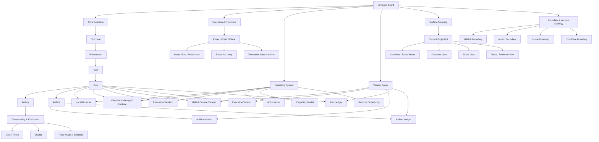

This page compresses the whole `toProject` system into one readable map.

Read it in this order:

1. `board` and `block` structure
2. object chain
3. execution control plane
4. runtime and sandbox
5. version spine and ledgers
6. observability and evaluation

## Architecture Map

<Tabs defaultValue="system-map">
  <TabsList>
    <TabsTrigger value="system-map">System Map</TabsTrigger>
    <TabsTrigger value="layered-svg">Layered SVG</TabsTrigger>
  </TabsList>
  <TabsContent value="system-map">

  </TabsContent>
  <TabsContent value="layered-svg">
    <ProjectArchitectureMapFigure />
  </TabsContent>
</Tabs>

## How to Read the System

### 1. Board and blocks
`toProject` is the board.

Its current blocks are:
- `Core Definition`
- `Execution Architecture`
- `Operating System`
- `Version Spine`
- `Surface Mapping`
- `Boundary & Version Strategy`

### 2. Object chain
The core execution object chain is:

`Outcome -> Workstream -> Task -> Run -> Activity / Artifact`

That means the system is not centered on tickets alone.

It is centered on execution units and their evidence trail.

### 3. Control plane
The project surface is a control plane, not a passive document.

It must express:
- current state
- current runtime posture
- current execution projection
- current artifact trail

### 4. Runtime and sandbox
Current runtime strategy is intentionally narrow:
- `Local Runtime`
- `Cloudflare Managed Runtime`

Execution should not happen in an unbounded host environment.

That is why `Execution Sandbox` exists as a separate topic:
- runtime answers `where`
- sandbox answers `how safely`

### 5. Version spine
Versioning is split into three layers:
- `GitHub Source Version`
- `Execution Version`
- `Artifact Version`

GitHub alone is not enough because it cannot fully explain:
- runtime posture
- run lineage
- artifact lineage
- cross-system execution evidence

### 6. Ledgers
The system needs two formal ledgers:
- `Run Ledger`
- `Artifact Ledger`

Those ledgers make execution auditable and recoverable.

### 7. Observability
Observability is not optional.

The system needs:
- cost and token visibility
- run quality visibility
- trace and log visibility
- evidence-level auditability

Without this layer, an agentic project system becomes expensive but unverifiable.
